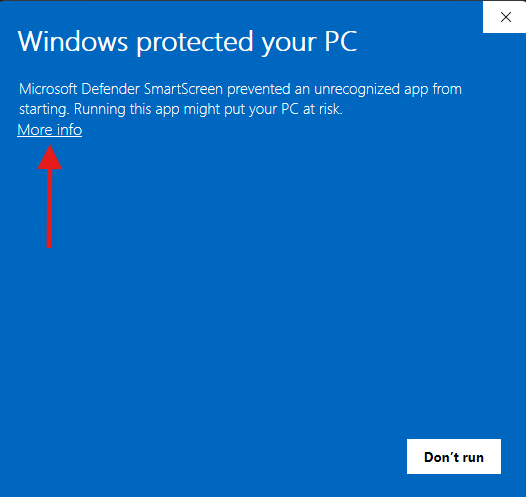
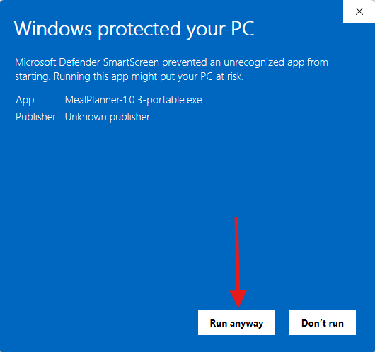

# Meal & Shopping Planner

A free, portable Windows desktop app for planning your weekly meals and generating a shopping list automatically.

---

## Download

Head to the [**Releases page**](https://github.com/joemachen/meal-planner/releases/latest) and download `MealPlanner-X.X.X-portable.exe`.

No installation required — just run the file. Your data is saved to `%APPDATA%\Meal & Shopping Planner\`.

---

## First-time Windows warning

Because this app is not commercially code-signed, Windows Defender SmartScreen will show a warning the first time you run it. This is normal for open-source apps distributed outside the Microsoft Store.

**Step 1** — Click **More info**



**Step 2** — Click **Run anyway**



You will only see this once. After the first run, Windows remembers your choice.

---

## Features

- **Weekly Calendar** — plan lunch and dinner for each day (Sat → Fri). Save favourite weekly plans and reuse them.
- **Meal Library** — store your go-to meals with ingredients and quantities.
- **Single Items** — maintain a persistent list of household essentials (paper towels, soap, etc.) that always appear on the shopping list when checked.
- **Shopping List** — auto-generated from the week's meals plus any active single items, grouped by category.
- **Dark / Light mode** — follows your OS setting by default; toggle manually in Settings.
- **Backup & Restore** — export and import your database from the Settings tab.

---

## Usage

1. Go to **Meal Library** and add your meals with ingredients.
2. Open **Weekly Calendar** and click any cell to assign a meal, or mark a day as Order in / Dine out / Leftovers.
3. Click **Save calendar**, then switch to **Shopping List** to see everything grouped by category.
4. Check off essentials you need in **Single Items** — they'll appear on the list automatically.

---

## Data & privacy

All data is stored locally on your machine at:

```
%APPDATA%\Meal & Shopping Planner\vibemeal.db
```

Nothing is sent anywhere. No accounts, no internet connection required.
